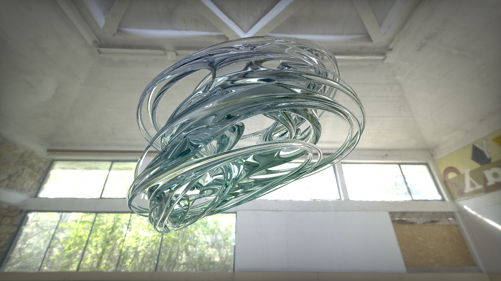

# Unity-Quaternion-Julia-Glass
A Julia set study in Unity.
Based on [this shader](https://www.shadertoy.com/view/tdjczh) but it is heavily relied on others'code on Shadertoy. I don't think that its CC license works...

